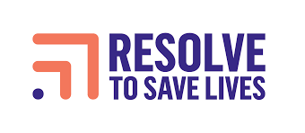

# Health Data Analytics with R Training  

  
  &nbsp;&nbsp;&nbsp;&nbsp;
  

  <strong>National Data Management and Analytics Center (NDMC), EPHI</strong> 
  in collaboration with 
  <strong>Resolve to Save Lives (RTSL)</strong>

---

**Authors**: [Leykun Getaneh](https://github.com/leykunget) and [Yebelay Berehan](https://github.com/Yebelay)

---

## 📖 Overview

This repository contains **training materials and slides** for the
**Health Data Analytics Training** organized by:

> **National Data Management and Analytics Center (NDMC), EPHI** in collaboration with
> **Resolve to Save Lives (RTSL)**

The training is designed to strengthen the data analytics capacity of **RDMCs**, **PHEM**, and **EPHI** professionals to support evidence-based public health decision-making in Ethiopia.

---

## 🎯 Learning Objectives

By the end of the training, participants will be able to:

* Install and navigate **R** and **RStudio**
* Import, clean and export datasets
* Perform data management using **tidyverse**
* Create visualizations with **ggplot2**
* Conduct basic data analysis and univariate time series analysis
* Produce reproducible reports using **Quarto**
* Building dashboard using **Quarto**

---

## 🗓️ Training Schedule

**June 17 – June 20, 2026**

| Day   | Topic                                                | Facilitators     |
| ----- | ---------------------------------------------------- | ---------------- |
| Day 1 | Introduction to R, RStudio, and data import, Data management (dplyr)          | Leykun & Yebelay |
| Day 2 | Data management; Data visualization (ggplot2)                        | Yebelay & Leykun |
| Day 3 | Basic analysis & Univariate time series analysis and forecasting          | Yebelay & Leykun |
| Day 4 | Reproducible reporting (Quarto) & Quarto Dashboard     | Leykun & Yebelay |

---

## 📂 Training Materials

| Module                          | HTML        | PDF             |
| ------------------------------- | ----------- | --------------- |
| Introduction to R & Data import export | 🔗 [View](https://leykungetaneh.quarto.pub/introduction-to-r-and-rstudio-8ea6/#/title-slide) | ⬇️ [Download]() |
| Data Management (dplyr)         | 🔗 [View](https://yebelay.rbind.io/static/slides/datamanagment/datamanagment_malaria#/title-slide) | ⬇️ [Download]() |
| Data Visualization (ggplot2)    | 🔗 [View](https://leykungetaneh.quarto.pub/data-visualization-with-ggplot2-b98c/) | ⬇️ [Download]() |
| Basic Data Analysis             | 🔗 [View](https://yebelay.rbind.io/static/slides/datamanagment/day4_basicanalysis_malaria#/title-slide) | ⬇️ [Download]() |
| Univariate time series analysis | 🔗 [View]() | ⬇️ [Download]() |
| Reproducible Reporting (Quarto) | 🔗 [View](https://leykungetaneh.quarto.pub/reproducible-reporting-with-quarto/#/title-slide) | ⬇️ [Download]() |
| Quarto dashboard.               | 🔗 [View](https://leykungetaneh.quarto.pub/quarto-dashboards-6137/#/title-slide) | ⬇️ [Download]() |

---

## 📝 Surveys

Please complete both surveys:

* [Registration & Pre-training Survey](https://forms.gle/jWWARJ2S3ztfrFmLA)

* [Post-training Survey]()

---

## ⚙️ Installation Guide

> ⚠️ Install **R first**, then **RStudio**

### 1️⃣ Install R

-   **For Windows: [Download R](https://cran.r-project.org/bin/windows/base/release.htm)**
-   **For Mac: [Download R](https://cran.r-project.org/bin/macosx/)**

---

### 2️⃣ Install RStudio

-   **For Windows: [Download Rstudio](https://www.rstudio.com/products/rstudio/download/#download)**
-   **For Mac: [Download Rstudio](https://www.rstudio.com/products/rstudio/download/#download)**

---

### How to Use This Repository

1. Open **HTML slides** for interactive learning
2. Download **PDF slides** for offline access
3. Check regularly for updates throughout the training

---

###  Contact

For questions or support:

📧 [leyk.get@gmail.com](mailto:leyk.get@gmail.com)

---

